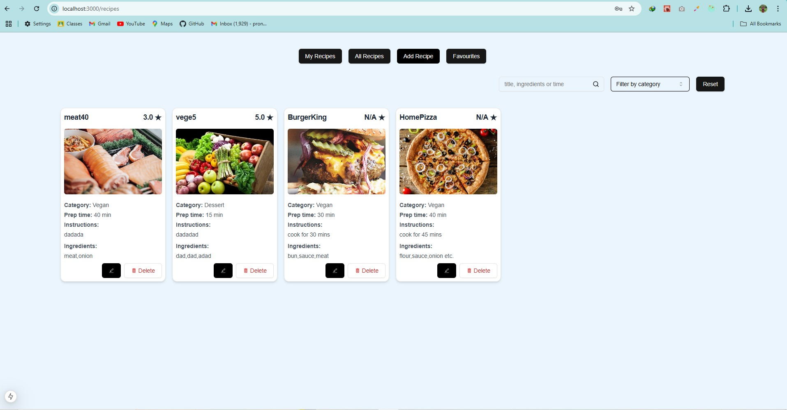
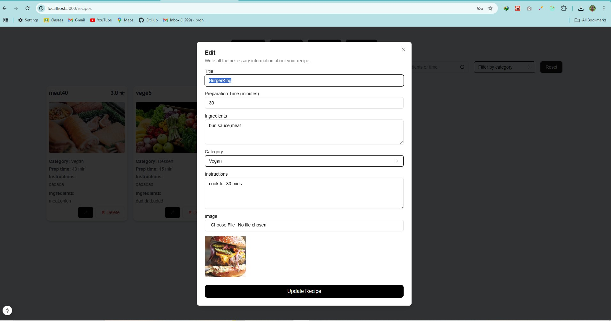
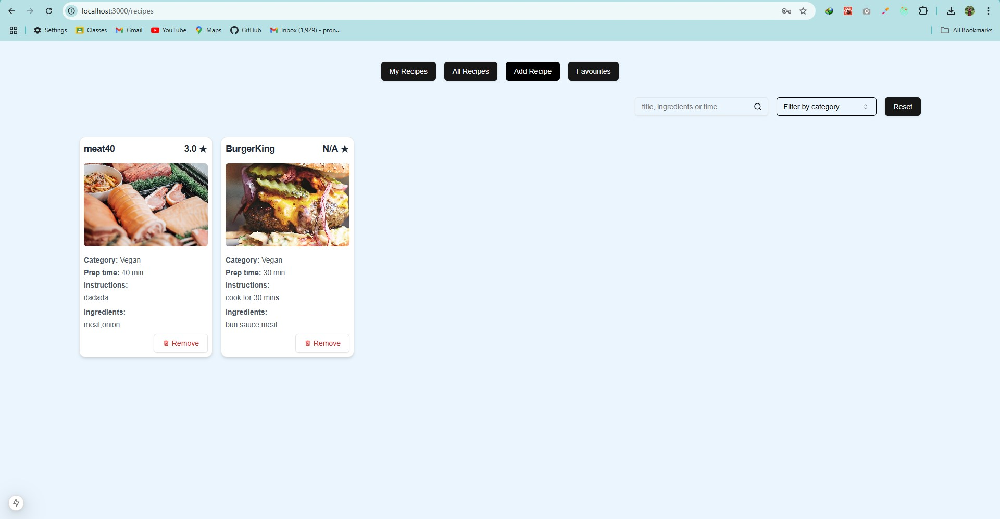
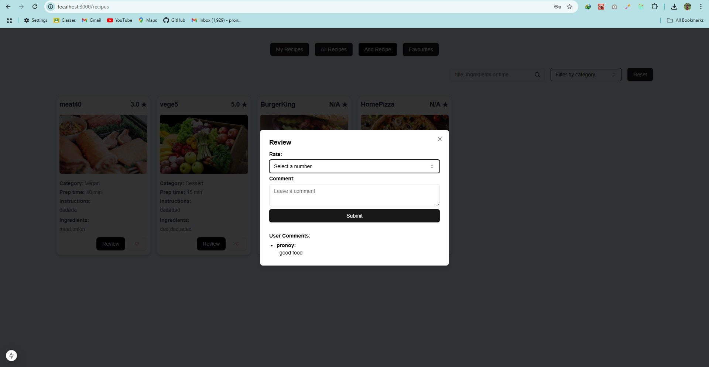

# Recipe Sharing Platform

## UI:    

## Features

### User Registration (Simulated)

- Users can sign up and log in (no real authentication, user data stored locally or in JSON server).

### Recipe Creation & Management

- Users can create, edit, and delete their own recipes.
- Recipes include title, ingredients, instructions, images (URLs), and preparation time.
- Recipes are stored in and fetched from the JSON server.

### Search and Filter Recipes

- Users can search recipes by title, ingredients, or cooking time.
- Filter recipes by pre-defined categories (e.g., breakfast, vegan, dessert).

### Ratings & Reviews

- Users can rate recipes (1–5 stars) and leave comments.
- Ratings and reviews are linked to users and recipes in the JSON server.

### Save Recipes to Favorites

- Users can save favorite recipes to their personal collections.
- Saved recipes are stored in the JSON server.

### Recipe Management Dashboard

- Users can view and manage all their created recipes and saved favorites.

### Share Recipes

- Users can copy a link (recipe ID) to share their recipes.

### Global State Management (Optional)

- Use state management (like Redux or any other) to handle recipe lists, user actions, and login status.

### Responsive Design\*\*

- The app should be responsive and work across all devices (mobile, tablet, desktop).
